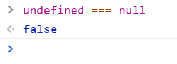
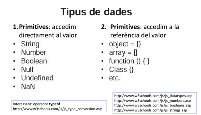
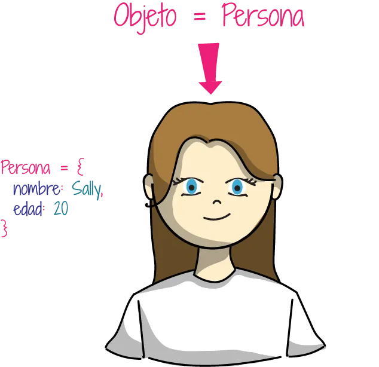
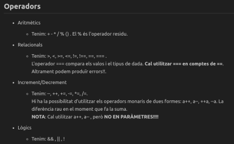
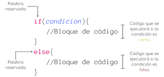

## Desenvolupament d'aplicacions web en entorn client

- [Desenvolupament d'aplicacions web en entorn client](#desenvolupament-daplicacions-web-en-entorn-client)
- [introduccio](#introduccio)
- [Tipus de comentaris en JavaScript](#tipus-de-comentaris-en-javascript)
- [Tipus de dades en JavaScript](#tipus-de-dades-en-javascript)
  - [**_Número (number)_**:](#número-number)
  - [**_String_**:](#string)
  - [**_boolean_**:](#boolean)
  - [**_Null_:**](#null)
  - [**_Undifined:_**](#undifined)
- [Tipus de declaracions de Variables en JavaScript](#tipus-de-declaracions-de-variables-en-javascript)
  - [1.**_Constants_**](#1constants)
  - [2.**_let_**](#2let)
  - [3.**_var_**](#3var)
  - [diferencia entre let i var](#diferencia-entre-let-i-var)
- [Funcions en Java Script](#funcions-en-java-script)
  - [Decalarar la funcio](#decalarar-la-funcio)
  - [Paràmetres de un funció](#paràmetres-de-un-funció)
  - [funcions declarades](#funcions-declarades)
  - [funcions expresades (anonimés )](#funcions-expresades-anonimés-)
  - [Arrow functions](#arrow-functions)
- [Objectes en Java Script](#objectes-en-java-script)
- [Obtenir valors d'un objecte](#obtenir-valors-dun-objecte)
- [desestructuració d'objectes](#desestructuració-dobjectes)
- [Objectes Nadius](#objectes-nadius)
  - [Date](#date)
  - [String](#string-1)
- [Objectes literals](#objectes-literals)
- [Operadors en Javascript](#operadors-en-javascript)
- [Condicionals en javascript](#condicionals-en-javascript)
  - [Condicionals if / else](#condicionals-if--else)
  - [Condicionals switch case](#condicionals-switch-case)
- [estructures iteratives](#estructures-iteratives)
  - [while](#while)
  - [do...while](#dowhile)
  - [for](#for)
  - [for Each](#for-each)
  - [for in](#for-in)
  - [for of](#for-of)
- [gestió d'errors](#gestió-derrors)
  - [**_try catch_**](#try-catch)
  - [**_finally:_**](#finally)
  - [**_El throw:_**](#el-throw)
- [Break i Continue](#break-i-continue)
  - [**Break**](#break)
  - [**Continue**](#continue)
- [Parametres REST \& SPREAD](#parametres-rest--spread)
- [EXP REGULARS](#exp-regulars)
- [MODULS EN JS](#moduls-en-js)


<span style="color:yellow">

## introduccio

</span>
<br>
JavaScript és el llenguatge de programació usat per a les pàgines web, compatible amb tots els navegadors
i que forma un estàndard de desenvolupament que ara també s'estén a dispositius o programes de
propòsit general multiplataforma, i JavaScript no és un llenguatge orientat a objectes pero es un lenguatge propototipus      
            Tradicionalment, l'orientació a objectes es realitza per classes. En els llenguatges orientats a prototips, però, tenim un model de treball una mica diferent a l'hora de crear els objectes ia l'hora de definir com uns objectes poden heretar-ne les característiques.

A l'orientació a prototips, en lloc de tenir classes, tens objectes individuals que poden ser clonats o estesos per crear nous objectes. Els objectes poden heretar propietats i mètodes daltres objectes. És com si en lloc de crear cases mitjançant un plànol es creessin mitjançant la còpia d'una altra casa existent. Aquest procés és anomenat "cadena de prototips".
<br>

<span style="color:yellow">

## Tipus de comentaris en JavaScript

</span>
<br>
En Java Script hi ha dos Tipus de Comentaris, Comentari d'una línia(//) i múltiples línies (/**/)

```javascript
//Aquest es un Comentari de una línia
console.log("Bones");
/*
    Aquest
    es 
    un comentari de 
    multiples línies
    */
console.log("Hola");
```

---

<br>

<p style="font-size=20px;">
<b>

[☝️ Retorn a l'index](#desenvolupament-daplicacions-web-en-entorn-client)
</b></p>

<br>

---

<br>
<span style="color:yellow">

## Tipus de dades en JavaScript

</span>
<br>
A JavaScript podem dir que admet vuit tipus de dades: número, BigInt, booleà, string o cadena, valor nul, indefinit, símbol i objecte.

#### **_Número (number)_**:

El tipus number representa tant nombres enters com de punt flotant.

```javascript
let numero1 = 9;
let numero2 = 3.56;
let numero3 = new Number(99.13);
```

#### **_String_**:

Un string en JavaScript és una cadena de caràcters i s'ha de col·locar entre cometes.

```javascript
// Tipus Cadena o string
let nom = "Aissam bouazama";
```

#### **_boolean_**:

Per simplificar-ho una mica més els tipus de dades en JavaScript es poden classificar àmpliament en dues categories: tipus de dades primitives i tipus de dades no primitives. On un objecte és un tipus de dades no primitives o complexes, i la resta són tipus de dades primitives.

```javascript
//Boolean
let fals = false;
console.log(typeof fals);
let Cert = true;

let v = new Boolean(true);

//valors que tendeixen a cert  (Truthy)
//i valors que tendeixen a fals (Falsy)

console.log(new Boolean(-0));
console.log(new Boolean([]));
```

<br>

#### **_Null_:**

Null a JavaScript és una paraula clau que ens permet definir un valor nul o buit de manera intencional. És a dir, en comptes de fer servir altres tipus de valors, com podrien ser un nombre o un string, omplim l'espai de codi amb un valor buit de significat.

```javascript
let noDefinida = null;
console.log(noDefinida);
```

i null no es igual a undifined



<br>

#### **_Undifined:_**

undefined és un valor primitiu que s'assigna automàticament a les variables que han estat declarades però no inicialitzades. També es torna quan s'intenta accedir a una propietat d'un objecte que no existeix

<span style="margin-left:15%;">



</span>
<br>
Però una cosa que hem de tenir en compte en JavaScript, i que de vegades complica les coses una mica, és que es tracta d'un llenguatge de tipus dinàmic, cosa que significa que els tipus de variables es comproven durant el temps d'execució. La mateixa variable pot contenir valors de diferents tipus en qualsevol moment.
<br>

---

<br>

<p style="font-size:50px;">
<b>

[☝️ Retorn a l'index](#desenvolupament-daplicacions-web-en-entorn-client)
</b></p>

<br>

---

<span style="color:yellow">

## Tipus de declaracions de Variables en JavaScript

</span>
<br>

Hi ha tres maneres per declarar les variables maneres local, global i constants

#### 1.**_Constants_**

un cop has declarat una variable amb const, no pots tornar a assignar-li cap altre valor. La variable es tracta com una constant, cosa que significa que el seu valor no pot canviar després d'haver estat inicialitzat.<br>
_Exemple_

```javascript
//i els valors els donen al mateix moment de la declaració
const PI = 3.1416;
```

#### 2.**_let_**

Let és una paraula clau de JavaScript que s'utilitza per declarar una variable amb abast de bloc. Això significa que la variable declarada amb Let només és visible i accessible dins del bloc en què es va declarar, cosa que pot ajudar a evitar errors i millorar la llegibilitat del codi.

```javascript
//exemple de let
let variablelocal;
```

#### 3.**_var_**

Les variables declarades amb var poden: tenir la funció com a entorn de visibilitat, o bé ser globals. La seva visibilitat travessa els blocs.

```javascript
//exemple de var
var variableglobal;
```

<span style="color:#FFA500">

#### diferencia entre let i var

</span>
<br>

| let                                                            | var                                                                                  |
| -------------------------------------------------------------- | ------------------------------------------------------------------------------------ |
| podem limitar la visibilitat de la variable a aquest bloc i no | els variables declarades amb var les seves visibilitats travessa els blocs (globals) |

---

<br>

<p style="font-size:30px;">
<b>

[☝️ Retorn a l'index](#desenvolupament-daplicacions-web-en-entorn-client)
</b></p>

<br>

---

<br>

<span style="color:yellow">

## Funcions en Java Script

</span>
<br>

Les funcions ens permeten agrupar línies de codi en tasques amb un nom, perquè posteriorment puguem fer referència a aquest nom per realitzar tot el que s'agrupi en aquesta tasca,son objectes i elemens de primer nivel (per que s'utilitzen en qualsevol part del codi poden ser inicialitzacions de variables parametres de Functions)
. Per utilitzar funcions cal fer 2 coses:

Declarar la funció: Preparar la funció, donar-li un nom i dir-li les tasques que farà.
Executar la funció: «Trucar» a la funció perquè realitzi les tasques del contingut.

<span style="color:#FFA500">

#### Decalarar la funcio

</span>
<br>

```javascript
//exemple de com es fa la declaracio i la execusio d efuncions
//funcions declarades
function aixoesunfuncioDecalarada() {
  console.log("hola estic en una funcio declarada");
}
//crida de la funcio
aixoesunfuncioDecalarada();
```

<span style="color:#FFA500">

#### Paràmetres de un funció

</span>
<br>

A les funcions se'ls poden passar paràmetres (hi ha també parametres per defecte a la funció), que només són variables que els passem des de fora cap a dins de la funció. A més, també podem fer que la funció faci les seves tasques i ens torni un resultat cap a l'exterior de la funció.

```javascript
function suma(a, b) {
  return a + b;
}
console.log(suma(7, 7));

//functions amb valors per defecte son aquestes si no el donem un valor agafa un valor per defecte

function saludar(nom = "AISSAa", salutacio = "hola") {
  console.log(salutacio + " " + nom);
}

saludar("aissam", "hola");
saludar();
```

<span style="color:#FFA500">

#### funcions declarades

</span>
<br>

---

Les funcions declarades inicien amb la paraula reservada function, seguit del nom de la funció, una llista de paràmetres que pot ser opcional i van entre parentesis, seguida d'unes claus on aniran les nostres sentències. Les funcions es declaren però per poder-les fer servir, cal fer-ne la crida. Quan creem una funció passant-li els paràmetres entre els parentesis, en anomenar la funció li hem d'incloure els arguments.

```javascript
//funvio declarada
function salutacio2() {
  console.log("hola dins de una funció declarada");
}
salutacio2();
```

<br>
<span style="color:#FFA500">

#### funcions expresades (anonimés )

</span>
<br>

---

L'estructura d'aquestes funcions és similar a l'anterior, però no és obligatori que tinguin nom. Aquesta funció es pot emmagatzemar en una variable o constant.

```javascript
const salutacio = function () {
  console.log("hola des de una funció expresada");
};
salutacio();
```

<br>
<span style="color:#FFA500">

#### Arrow functions

</span>
<br>

Per crear-les podem definir una llista de paràmetres, poden tenir-los o no; seguit del flat arrow o fletxa i en cas que sigui només una sentència o instrucció que es realitzarà o executar, es poden ometre les {}, sense tenen diverses sentències s'han d'incloure les {}.

```javascript
//arrow function
let salutacio3 = () => console.log("hola des de un Arrow function");

salutacio3();

//paraméstres
let salutacio4 = (nom) => console.log(`hola ${nom}`);
salutacio4("Aissam");

//call back ARROW function

const numeros = [11, 22, 33, 44, 55, 66];
//si hi ha  una sola una linia fa reurn automatic
numeros.forEach((ele, id) => {
  console.log("l'element " + ele + " és a la posició " + id);
});
//el this en un arrow function fa la crida el window (fa el hosting per i busca el window)
// COMPTE NO UTILIZAR ARROW FUNCTIONS ALS OBJECTES (perque l'ambit fa un hosting a l'objecte window )
const gos2 = {
  nom: "negra",
  bordar: () => console.log(this),
};
gos2.bordar();

//A les arrow functions si hi ha varies linies de codi cal possar claus
/*
        no poden invocar-se abans de la seva declaració
        Es habitual declarar-les constants (Const)
        se les coneix com funcions anonimes, per que no tenen nom 
        i la funció s'assigna a una variable
      */
const varieslinies = () => {
  console.log("primera linia de codi ");
  console.log("segona linia de codi ");
};

varieslinies();
```

<b>

[☝️ Retorn a l'index](#desenvolupament-daplicacions-web-en-entorn-client)
</b>

<br>

---

<br>

<span style="color:yellow">

## Objectes en Java Script

</span>
<br>



Un objecte, al contrari que les variables primitives, pot contenir més d'un valor (pot està format per diverses dades que, a més, poden ser de diferents tipus).

Les variables que formen un objecte se'n diuen propietats o atributs i poden ser de diferents tipus, fins i tot altres objectes compostos (arrays o objectes de qualsevol tipus).
Cada propietat té un nom i un valor associat.

Els objectes es representen amb claus i separant les propietats amb una coma:

<b style="color:red;">**{}**</b> és un objecte buit.

<b style="color:red;">

**{nom: "Aissam", cicle: "DAW"}**
</b> és un objecte amb 2 propietats (o atributs).  
<br>

```javascript
//declarar i instanciar un objecte
const objecte2 = new Object();
console.log(objecte2);
//donem valors a un objecte
//per utilitzar els variables al mateix objecte hi ha d'utilitzar la paraula reservada this per fer la referncia al
//objecte mateix
const objecte3 = {
  nom: "Aissam",
  cognoms: "Bouazama",
  edat: 19,
  hobbys: ["Futbòl", "saltar", "cridar"],
  contactes: {
    email: "abouzama@almata.cat",
    twitter: "@Aissam",
    mobil: 452154822,
  },
  saludar: function () {
    console.log("hola que tal");
  },
  saludar2: function () {
    console.log(`hola ${this.nom} tinc ${this.edat} anys.`);
  },
};
```

[☝️ Retorn a l'index](#desenvolupament-daplicacions-web-en-entorn-client)
</b>

<br>

---

<br>

<span style="color:yellow">

## Obtenir valors d'un objecte

</span>
<br>

Per obtenir els valors d'un objecte, podem fer-ho col·locant el nom de l'objecte seguit d'un punt (.) i després la propietat, o podem al nom de l'objecte, col·locar-hi després entre claudàtors el nom de la propietat.

```javascript
// Accés als atributs i metodes
console.log(objecte3["nom"]);
console.log(objecte3.hobbys[1]);
console.log(objecte3.contactes.mobil);
//aquest es per probar si té algun propietat al objecte
console.log(objecte3.hasOwnProperty("nom"));
```

[☝️ Retorn a l'index](#desenvolupament-daplicacions-web-en-entorn-client)
</b>

<br>

---

<br>

<span style="color:yellow">

## desestructuració d'objectes

</span>
<br>

---

La destructuració d'objectes es nova forma d'inicialitzar variables apartir de un array o un objecte
exemple de destructuració de un array

```javascript
//sense desestructuració
let matriu = [12, 15, 46];
let a1 = matriu[0];
let a2 = matriu[1];
let a3 = matriu[2];

//amb desestructuració
let matriu2 = [12, 15, 46];
const [primer, segon, tercer] = matriu2;
console.log(primer, segon, tercer);
```

exemple de un objecte és molt important que el nom de les variables conincedeixi exactament amb el nom dels atributs de l'objecte
i es pot agafar qualquier atribut del objecte amb la utilitzacio del seu nom

```javascript
let persona = {
  nom: "Joan",
  cognoms: "Jimenez Perez",
  edat: 55,
};
//és molt important que el nom de les variables conincedeixi exactament amb el nom dels atributs de l'objecte
//i es pot agafar qualquier atribut del objecte amb la utilitzacio del seu nom
let { edat, nom, cognoms } = persona;
console.log(edat, nom, cognoms);
```

<br>

<span style="color:yellow">

## Objectes Nadius

</span>
<br>

---

<br>
<span style="color:#FFA500">

#### Date

</span>
<br>

| Mètode               | Descripció                                                                                                                                         |
| -------------------- | -------------------------------------------------------------------------------------------------------------------------------------------------- |
| `parse`              | Converteix una cadena que representa una data en el nombre de mil·lisegons transcorreguts des de les 12 en punt de la nit de l'1 de gener de 1970. |
| `getDate`            | Retorna el dia del mes segons l'hora local.                                                                                                        |
| `getDay`             | Retorna el dia de la setmana segons l'hora local.                                                                                                  |
| `getFullYear`        | Retorna l'any segons l'hora local.                                                                                                                 |
| `getHours`           | Retorna l'hora segons l'hora local.                                                                                                                |
| `getMilliseconds`    | Retorna el mil·lisegon segons l'hora local.                                                                                                        |
| `getMinutes`         | Retorna el minut segons l'hora local.                                                                                                              |
| `getMonth`           | Retorna el mes segons l'hora local.                                                                                                                |
| `getTime`            | Retorna el nombre de mil·lisegons transcorreguts des de les 12 en punt de la nit de l'1 de gener de 1970.                                          |
| `getSeconds`         | Retorna el segon segons l'hora local.                                                                                                              |
| `getTimezoneOffset`  | Retorna els minuts de diferència entre l'hora local i l'UTC.                                                                                       |
| `getUTCDate`         | Retorna el dia del mes segons l'hora universal.                                                                                                    |
| `getUTCDay`          | Retorna el dia de la setmana segons l'hora universal.                                                                                              |
| `getUTCFullYear`     | Retorna l'any segons l'hora universal.                                                                                                             |
| `getUTCHours`        | Retorna l'hora segons l'hora universal.                                                                                                            |
| `getUTCMilliseconds` | Retorna el mil·lisegon segons l'hora universal.                                                                                                    |
| `getUTCMinutes`      | Retorna el minut segons l'hora universal.                                                                                                          |
| `getUTCMonth`        | Retorna el mes segons l'hora universal.                                                                                                            |
| `getUTCSeconds`      | Retorna el segon segons l'hora universal.                                                                                                          |
| `toString`           | Converteix la data en una cadena literal que la representa.                                                                                        |
| `toDateString`       | Converteix una data en una cadena llegible per a éssers humans.                                                                                    |
| `toUTCString`        | Converteix una data en una cadena d'acord amb la convenció UTC d'Internet.                                                                         |
| `toLocaleString`     | Converteix una data en una cadena d'acord amb la convenció de l'hora local.                                                                        |
| `toLocaleDateString` | Com l'anterior, però només per la part de dia/mes/any.                                                                                             |
| `toLocaleTimeString` | Com l'anterior, però només per la part d'hora/minut/segon.                                                                                         |
| `valueOf`            | Retorna el nombre de mil·lisegons transcorreguts des de les 12 en punt de la nit de l'1 de gener de 1970.                                          |

Amb el mètode getDay() obtenim el valor numèric del dia de la setmana entre 0 i 6, tenint en compte que es considera que la setmana comença en diumenge i per tant el dia 0 és diumenge i el 6 dissabte
|valor que retorna getDay() | dia |
|----------------------------------------------|-----------------
|`0` |`Diumenge` |
|`1` |`Dilluns` |
|`2` |`Dimarts` |
|`3` |`Dimecres` |
|`4` |`Dijous` |
|`5` |`Divendres` |
|`6` |`Dissabte` |

[☝️ Retorn a l'index](#desenvolupament-daplicacions-web-en-entorn-client)
</b>

<br>
<span style="color:#FFA500">

#### String

</span>
<br>

| Mètode         | Descripció                                                                                        |
| -------------- | ------------------------------------------------------------------------------------------------- |
| `charAt`       | Retorna el caràcter en un índex determinat de la cadena.                                          |
| `charCodeAt`   | Retorna el valor Unicode del caràcter en un índex determinat de la cadena.                        |
| `fromCharCode` | L'invers de l'anterior, converteix una cadena de valors Unicode en una literal.                   |
| `concat`       | Combina el text de dues cadenes per crear-ne una de nova.                                         |
| `indexOf`      | Retorna l'índex de la primera coincidència d'un caràcter dins d'una cadena, o -1 si no existeix.  |
| `lastIndexOf`  | Retorna l'índex de l'última coincidència d'un caràcter dins d'una cadena, o -1 si no existeix.    |
| `match`        | Cerca coincidències d'una expressió en una cadena literal. Retorna les coincidències, si n'hi ha. |
| `replace`      | Substitueix una expressió per una cadena dins d'una altra cadena.                                 |
| `search`       | Igual que `match`, però retorna els índexs de les coincidències, o -1 si no n'hi ha cap.          |
| `slice`        | Extreu una secció d'una cadena. Retorna la subcadena.                                             |
| `split`        | Retorna una matriu poblada amb subcadenes d'una cadena.                                           |
| `substr`       | Retorna els caràcters sol·licitats a partir d'un índex.                                           |
| `substring`    | Retorna els caràcters dins dels índexs especificats.                                              |
| `toLowerCase`  | Retorna la cadena en minúscules.                                                                  |
| `toUpperCase`  | Retorna la cadena en majúscules.                                                                  |

<br>

<br>

<br>

<span style="color:yellow">

## Objectes literals

</span>
<br>

Els literals d'objectes S'utilitzen per emmagatzemar col·leccions de dades i es poden utilitzar per representar estructures de dades complexes com ara objectes, matrius, funcions i fins i tot expressions regulars. Els literals d'objecte també s'utilitzen per emmagatzemar informació sobre una instància concreta d'un objecte, com ara el seu estat o comportament

```javascript
console.log("");
//Objectes literals
let nick = "pipiu",
  temps = 23;
console.log(nick, temps);

const gos = {
  nom: nick,
  edat: temps,
  bordar: function () {
    console.log("Guau Guau");
  },
};
console.log(gos);
let dog = {
  nick,
  edat,
  temps,
  raça: "caçador",
  bordar: function () {
    console.log("Guau Guau");
  },
};
console.log(dog);
```

[☝️ Retorn a l'index](#desenvolupament-daplicacions-web-en-entorn-client)
</b>

<br>

<br>

<br>

<span style="color:yellow">

## Operadors en Javascript

</span>
<br>



```javascript
//exemples
// a = a+1; ->  a += 1;
// a = a*5; -> a *= 5
//== Aquesta no lo importa el tipus deles variables
console.log("Operador ==");
console.log(7 == 7);
console.log(7 == "7");
console.log(0 == false);
//=== aquest es compara també el tipus
console.log("Operador ===");
console.log(7 === 7);
console.log(7 === "7");
console.log(0 === false);
//a++,a-- VS ++a, --a
//Compte no utilizar el a++ o a-- als parametres
let op2 = 2;
// imprime el primer el valor despres fa la operaio per aixo surt 2 al console.log
//i el ++op2 hace el primero la operacion i lo assigna al op2 i imprimira 3
console.log(op2++);
console.log(op2);
```

[☝️ Retorn a l'index](#desenvolupament-daplicacions-web-en-entorn-client)
</b>

<br>

---

<br>

<span style="color:yellow">

## Condicionals en javascript

</span>
<br>

<span style="color:#FFA500">

#### Condicionals if / else

</span>
<br>



utilitzem l'if seguit d'un else. Amb això podem establir una acció A si es compleix la condició i una acció B si no es compleix.

Exemple de condicionals

```javascript
//en aquest exemple es compleix el condicional pues mostra es major d'edat a la consola en el cas que no es compleix el condicional ef el else
let edat = 18;
if (edat >= 18) {
  console.log("es major d'edat");
} else console.log("menor d'edat");
```

```javascript
//operador ternari, immediate if
// () ? cert:fals;

let diaNit = hora >= 7 && hora <= 20 ? "és de dia" : "és de nit";
console.log(diaNit);
```

<br>

<span style="color:#FFA500">

#### Condicionals switch case

</span>
<br>

1. La sentència switch estableix que realitzarem múltiples condicions analitzant la variable nota.
1. Cada condició sestableix mitjançant un case, seguit del valor possible de cada cas.
1. El switch comença avaluant el primer case, i continua amb la resta, cap avall.
1. Fixa't que alguns case tenen un break. Això fa que deixi davaluar i surti del switch.
1. Els casos que no tenen break, no s'interrompen, sinó que se salta al següent case.
1. El cas especial default és com un else. Si no entra a cap dels anteriors, entra a default.

```javascript
//operador condicional casos
//en aquest exemple lo que fa es entrar al contingut del case 2 per que el opcioMenu = 2
let opcionMenu = 2;
switch (opcionMenu) {
  case 1:
    console.log("Alta");
    break;
  case 2:
    console.log("Baixa");
    break;
  default:
    console.log("Aquesta opció no existeix");
}
```

<b>

[☝️ Retorn a l'index](#desenvolupament-daplicacions-web-en-entorn-client)
</b></p>

<br>

---

<span style="color:yellow">

## estructures iteratives

</span>

<br>

<span style="color:#FFA500">

#### while

</span>

Una declaració while executa les seves instruccions sempre que una condició especificada s'avalui com a true,la prova de condició passa abans que s'executi l'expressió al bucle. Si la condició torna true, s'executa l'expressió i la condició es torna a provar. Si la condició torna false, l'execució s'atura i el control es passa a la instrucció que segueix a while.

```javascript
let comptador = 0;
while (comptador < 10) {
  console.log(comptador);
  comptador++;
}
console.log(comptador);
```

<b>

[☝️ Retorn a l'index](#desenvolupament-daplicacions-web-en-entorn-client)
</b>

<br>

---

<span style="color:#FFA500">

#### do...while

</span>

es repeteix fins que una condició especificada s'avaluï com a falsa,sempre sexecuta una vegada abans que es verifiqui la condició.

```javascript
do {
  console.log(comptador);
  comptador--;
} while (comptador > 0);
console.log(comptador);
```

<span style="color:#FFA500">

#### for

</span>
Un cicle for es repeteix fins que una condició especificada s'avaluï com a false. El bucle for JavaScript és similar al bucle for de Java i C.

```javascript
let a;
for (a = 1; a < 10; a++) {
  console.log(a);
}
console.log(a);
```

<span style="color:#FFA500">

#### for Each

</span>

El mètode forEach en JavaScript permet recórrer un array i aplicar a cadascun dels seus elements una acció en particular mitjançant una funció. Vegem-ne un exemple:

```javascript
let numeros = [22, 24, 35, 64, 77, 88];

numeros.forEach(function (element) {
  console.log(element);
});
```

Podem observar com el mètode forEach itera l'array numeros i aplica a cadascun dels seus elements la funció que rep com a paràmetre. Per a aquest exemple, la funció simplement mostra el valor de cada element de l'array a la consola.

<span style="color:#FFA500">

#### for in

</span>

La instrucció forin itera una variable especificada sobre totes les propietats enumerables d'un objecte. Per a cada propietat diferent, JavaScript executa les instruccions especificades. Una declaració forin té l'aspecte següent:

```javascript
let persona = {
  nom: "joan",
  cognoms: "jiminez",
  edat: 19,
};
for (const propietat in persona) {
  console.log(propietat);
}
```

<span style="color:#FFA500">

#### for of

</span>

La declaració for...of crea un bucle que es repeteix sobre objectes iterables (inclosos Array,objectes ), invocant un bucle d'iteració personalitzat amb declaracions que s'executaran per al valor de cada propietat diferent.

```javascript
//podem reecorrer qualsevol estructura iterable
for (const element of numeros) {
  console.log(element);
}
```

<b>

[☝️ Retorn a l'index](#desenvolupament-daplicacions-web-en-entorn-client)
</b>

<br>

---

<span style="color:yellow">

## gestió d'errors

</span>

<br>
hi ha una construcció sintàctica trycatch que ens permet “atrapar” errors perquè l'script pugui, en lloc de morir, fer alguna cosa més raonable.

```javascript
try {
  //codi sensible a produir un error
  console.log("bloc try");
} catch (error) {
  console.log("bloc catch");
} finally {
  // s'execute siempre
  console.log("bloc finally");
}
```

<span style="color:#FFA500">

#### **_try catch_**

</span>
Aquest bloc us permet gestionar l'execució del programa i prendre accions específiques quan passa un error. En envoltar una porció de codi amb un bloc try, el programa intentarà executar aquest codi. Si sorgeix un error durant l'execució, el control es transfereix automàticament al bloc catch, on pots definir com vols gestionar aquest error,i el parametre del catch (error) Aquest es el paràmetre es el que guarde el contingut del error en el cas de que passe el error

<span style="color:#FFA500">

#### **_finally:_**

</span>

El finally statement se utiliza para especificar un bloque de código que siempre se ejecutará, independientemente de si se produce o no un error en el código. Se puede utilizar para limpiar los recursos o realizar otras tareas que se deben realizar antes de que el código termine de ejecutarse.

<span style="color:#FFA500">

#### **_El throw:_**

</span>

statement es fa servir per llançar un error explícitament en una part del codi. L'error es pot personalitzar perquè tingueu un missatge específic

```javascript
//personalitzar els errors
try {
  let a = "hola";
  if (isNaN(a)) {
    throw new Error("el valor no és un número ");
  }
} catch (error) {
  console.log(`s'ha produit un error : ${error}`);
}
```

<b>

[☝️ Retorn a l'index](#desenvolupament-daplicacions-web-en-entorn-client)
</b>

<br>

---

<div style="color:yellow">

## Break i Continue

</div>

<br>

<span style="color:#FFA500">

#### **Break**

</span>

S'atura un bucle fent servir la paraula break. Aturar un bucle significa sortir-se'n i deixar-ho tot com està per continuar amb el flux del programa immediatament després del bucle.

```javascript
for (let a = 0; a < 10; a++) {
  console.log(a);
  if (a === 5) {
    break;
  }
}
```

<b>

[☝️ Retorn a l'index](#desenvolupament-daplicacions-web-en-entorn-client)
</b>

<br>

---

<span style="color:#FFA500">

#### **Continue**

</span>

Serveix per tornar al principi del bucle en qualsevol moment, sense executar les línies que hi hagi per sota de la paraula continue.

```javascript
let b = 1,
  continuar = true;
while (b <= 15 && continuar) {
  if (b === 4) {
    continuar = false;

    continue; //torna aevaluar l'expressio boolean de les iteracions
  }
  console.log("b = " + b);
  b++;
}
```

[☝️ Retorn a l'index](#desenvolupament-daplicacions-web-en-entorn-client)
</b>

<br>

---

<br>

<span style="color:yellow">

## Parametres REST & SPREAD

</span>
<br>

JavaScript utilitza tres punts (...) tant per a la rest com per als operadors de spread propagació. Però aquests dos operadors no són el mateix.

La diferència principal entre rest i spread és que l'operador rest posa la resta d'alguns valors específics proporcionats per l'usuari en una matriu JavaScript. Però la sintaxi de propagació amplia els iterables en elements individuals.

```javascript
//parametre REST (...)
function restar(a, b, ...c) {
  let resultat = a - b;
  c.forEach(function (ele) {
    resultat -= ele;
  });
  console.log(c);
  return resultat;
}

console.log("resultat = ", restar(6, 1, 1, 1, 1, 1));

//parametre Spread o de propagació
//el spread separa varios arrays i unirles a un array expandeix els elements o un sol array

let array1 = [1, 2, 3, 4, 5];
let array2 = [6, 7, 8, 9, 0];
let array3 = [array1, array2];
console.log(array3);
let array4 = [...array1, ...array2, ...array3];
console.log(array4);
```

[☝️ Retorn a l'index](#desenvolupament-daplicacions-web-en-entorn-client)
</b>

<br>

---

<br>

<span style="color:yellow">

## EXP REGULARS

</span>
<br>

Les expressions regulars són patrons que s'utilitzen per fer coincidir combinacions de caràcters en cadenes

```javascript
/*/c..o\.txt/gm

       les expressions regulars van entre (comenza amb una una i acaba amb una barra )/ i /
       i el global significa busca qualsevol al text sens el global només busca la primera
       /s es un espain en blanc
       aquesta es busca qualquier paraula que comenza amb algun caracter  de les que estan dins de [] només un caracter no més
       [cmt]asa   (ex:casa)  [Hh]ola   ex:hola
       [0-9] la baraa és lo que esta dins de 0 a 9
       \d és por los digits
       [A-Za-z0-9] del a a z min i de A -Z may i  0 -9a
       #[a-z]* lo repeteix fins que acaben
       #[a-z]+ lo repeteix pero no detecta 0 o # sol
       el * vol dir 0 o més
       \w és el mateix que aixo [A-Za-z0-9]
       per detectar un correo \w+@\w+\.\w+
       \w wolrds incluient els numeros
       \w+ un caracter o més
       . es un caracter
      (i) es multi case may i minuscules
      ^aquest es el No
      exemple ([^a-z] no de a-z minusculas)
      la [A-Z]{2,} que estan al final de 2 a infinit
      la [A-Z]{2,5} que estan de 2 a 5
       */
```

[☝️ Retorn a l'index](#desenvolupament-daplicacions-web-en-entorn-client)
</b>

<br>

---

<br>

<span style="color:yellow">

## MODULS EN JS

</span>
<br>

Un mòdul és un fitxer de JavaScript que agrupa funcions, classes, variables que després poden ser exportades i utilitzades en altres parts de la nostra aplicació. Un mòdul permet amagar funcionalitat del mateix i només exportar allò per al que ha estat implementat.
Per consumir un mòdul des d'un altre mòdul o una pàgina HTML hem d'utilitzar la paraula clau import

EXEMPLE
aquest és fitxer de js llibreriria.js que té un constant ,un function i un objecte exportats

```javascript
const PI = 3.141592;
export default PI;
//la exportacio de constants i variable per defecte
//cal fe-la en dos passos Primer declarar i depsres exportar
export function saludar() {
  console.log("Bona tarda!");
}

//el default es carregara automaticament la llibreria a la memoria

//el default no espot utilitzar més de un al mateix modul
//no espot utilitzar arrow function
export let persona = {
  nom: "Aissam",
  edat: 19,
  correr: function () {
    console.log("estic corrent....");
  },
};
```

i aquest és el fitxer que importer functions
de la llibreria

```javascript
import PI, { persona, saludar } from "./llibreria.js";
//per que es default  s'ha de posar fora dels claus
console.log(PI);
saludar();

console.log(persona);
persona.correr();

//els claus permeten que els variables seran locals
//s'executa con los claus que estan al final esso es autoexecutable
let edat = (function (nom) {
  console.log(`funció autoexecutable nom = ${nom}`);
  let edat = 19;
  return edat;
})("Aissam");

console.log(edat);
```

És molt important indicar al navegador que estem utilitzant la nova tecnologia de mòduls assignant a la propietat type el valor de 'module':

       <script type="module">

```javascript
<!DOCTYPE html>
<html lang="en">
  <head>
    <meta charset="UTF-8" />
    <meta name="viewport" content="width=device-width, initial-scale=1.0" />
    <title>Document</title>
  </head>
  <body>
    <h1>HOLA</h1>
    <!--qualsevol sript que té import hem de fer
    el tipus de module per ue funcione-->
    <script src="js/script.js" type="module"></script>
  </body>
</html>

```
